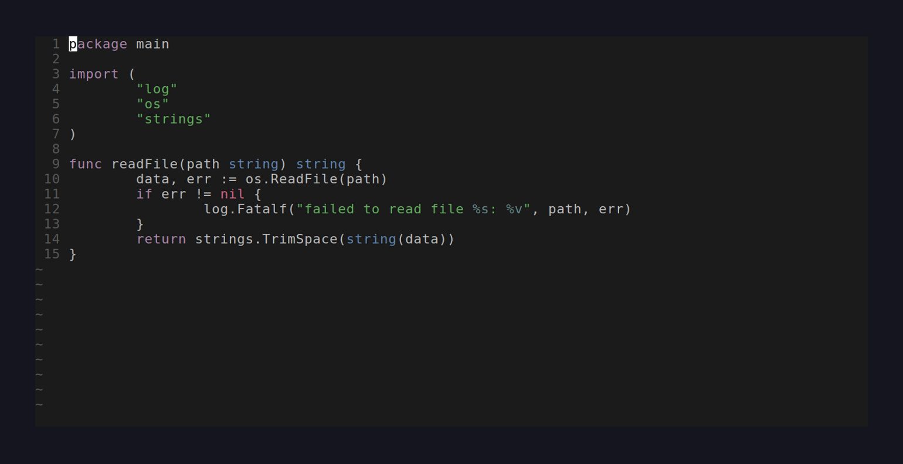

# Neopi

Neopi is a small Neovim plugin that sends code and prompts from your editor to the [Pi coding agent](https://github.com/earendil-works/pi-coding-agent).

The goal is to keep Neovim as your main coding surface while Pi works asynchronously in the background through acpx.

> Status: early prototype



## Why Neopi?

When coding in Neovim, you often want to ask an agent to inspect, edit, explain, or refactor a specific piece of code without leaving your editor.

Neopi lets you:

- visually select code in Neovim
- run a command like `:Pi refactor this function`
- send the selected code plus useful context to Pi through acpx
- keep editing while Pi works asynchronously in the background
- see inline progress and completion status in Neovim
- resume follow-up prompts for code ranges that already have Pi sessions
- open a session transcript with `:PiView` to review thinking, tool calls, and stream follow-up prompts

## Installation

### lazy.nvim

After pushing this repository to GitHub, users can install it with [lazy.nvim](https://github.com/folke/lazy.nvim):

```lua
{
  "jettandres/neopi",
  config = function()
    require("neopi").setup()
  end,
}
```

For local development, you can point lazy.nvim at a local checkout:

```lua
{
  dir = "/path/to/neopi",
  config = function()
    require("neopi").setup()
  end,
}
```

The plugin also defines `:Pi` automatically when loaded, so calling `setup()` is optional unless you want to override defaults.

If you use `mini.notify`, load it before Neopi and set it up normally:

```lua
{
  "nvim-mini/mini.notify",
  version = false,
  config = function()
    require("mini.notify").setup()
  end,
}
```

Neopi will use `MiniNotify.add/update/remove` for persistent acpx running notifications when available, and will fall back to `vim.notify` otherwise.

## Requirements

Neopi assumes the following environment:

- Neovim
- Pi coding agent installed and available as `pi`
- `acpx` installed and available as [acpx](https://github.com/openclaw/acpx)

Optional for the experimental interactive tmux backend:

- tmux
- you are already inside a tmux session

Optional for richer notifications:

- [`mini.notify`](https://github.com/nvim-mini/mini.notify)

Neopi defaults to the acpx backend for headless, programmatic Pi sessions. The tmux backend is experimental and still available for visible interactive Pi panes.

## Example workflow

Start inside Neovim.

Highlight some code using visual mode:

```lua
local function greet(name)
  print("hello " .. name)
end
```

Then run:

```vim
:'<,'>Pi make this safer and add input validation
```

Neopi will:

1. capture the selected lines
2. collect editor context, such as:
   - file path
   - filetype
   - selected line range
   - current working directory
   - git root, when available
3. create or reuse an acpx session
4. send the generated prompt/context to Pi through acpx
5. show inline status while Pi is running
6. refresh buffers after Pi finishes

Pi then runs asynchronously while you continue editing.

## Experimental tmux backend layout behavior

When using the experimental `backend = "tmux"`, the first `:Pi` invocation creates a vertical split on the right side of the current tmux window:

```text
+-----------------------------+---------------------+
|                             |                     |
|           Neovim            |      Pi task 1      |
|                             |                     |
+-----------------------------+---------------------+
```

The left pane remains dedicated to Neovim.

Future `:Pi` invocations create additional horizontal splits inside the right-hand Pi area:

```text
+-----------------------------+---------------------+
|                             |      Pi task 1      |
|                             +---------------------+
|           Neovim            |      Pi task 2      |
|                             +---------------------+
|                             |      Pi task 3      |
+-----------------------------+---------------------+
```

This allows multiple Pi prompts to run independently.

Each tmux pane is a persistent interactive Pi session, not a hidden one-off process. After Neopi sends the initial prompt, the pane remains available for follow-up conversation.

## Commands

### `:Pi {prompt}`

Send the current visual selection and prompt to Pi.

Example:

```vim
:'<,'>Pi explain this block and suggest simplifications
```

If no visual range is provided, Neopi may send the current file or cursor context depending on configuration.

### `:PiView [session]`

Open a transcript for an existing acpx session.

- With no argument, it uses the session attached to the region under the cursor (the same mapping used by `:Pi` follow-ups).
- With an argument, it opens that acpx session by name, for example `:PiView neopi-123456-1234`.

See [Session view](#session-view) below.

## Prompt sent to Pi

Neopi builds a structured prompt before starting Pi.

Example generated prompt:

````text
User request:
make this safer and add input validation

Context:
- File: lua/example.lua
- Filetype: lua
- Selection: lines 12-18
- Working directory: /path/to/project
- Git root: /path/to/project

Selected code:
```lua
local function greet(name)
  print("hello " .. name)
end
```
````

This keeps the user's prompt short while still giving Pi enough context to act usefully.

## Backends

### acpx backend

Neopi's default backend uses acpx for headless Pi sessions.

Instead of opening an interactive tmux pane, Neopi creates an acpx session and sends the generated prompt to Pi through acpx. This is better for progress indicators, completion tracking, cancellation, structured output, and refreshing buffers after edits. Follow-up happens through Neopi/acpx rather than by typing directly into a visible Pi pane.

Neopi forwards its `pi_command` to the ACP adapter through `PI_ACP_PI_COMMAND`, so the acpx backend uses the same Pi installation (and therefore the same default model from Pi's own settings) as the tmux backend, rather than whichever `pi` happens to be first on `PATH`.

```lua
require("neopi").setup({
  backend = "acpx",
  acpx = {
    command = "acpx",
    agent = "pi",
    format = "text",
    permissions = "approve-all",
    refresh_buffers_on_done = true,
  },
})
```

### tmux backend experimental

The experimental tmux backend launches normal interactive Pi sessions inside tmux panes. This keeps the agent visible and gives you a place to continue the conversation after the initial prompt.

```lua
require("neopi").setup({
  backend = "tmux",
})
```

## Editor feedback

Neopi can show lightweight inline status using Neovim virtual text and line-number highlighting.

While a task is active, the selected range's line numbers are highlighted so it is clear which block Pi is working on.

For the tmux backend, the indicator tracks prompt delivery:

```text
local function greet(name)        ⠋ Sending to Pi...
local function greet(name)        ✓ Sent to Pi pane %12
```

For the acpx backend, the indicator can track the headless job lifecycle:

```text
local function greet(name)        ⠋ Pi running via acpx...
local function greet(name)        ✓ Pi done neopi-123
```

After a new acpx session is created for a selected range, Neopi keeps a subtle line-number highlight on that range. If you later select an overlapping range and run `:Pi <follow-up>`, Neopi resumes the existing acpx session automatically.

When your cursor is on a range with an attached session, Neopi also shows a lightweight hint:

```text
local function greet(name)        Pi session exists — :Pi will resume it (neopi-123)
```

This paragraph-to-session mapping is currently local to the running Neovim instance. If you restart Neovim, the visual mapping is lost, but the underlying acpx sessions still exist.

This distinction matters because interactive Pi panes remain open for follow-up conversation, so Neopi cannot reliably know when the agent is truly "done" in tmux mode.

When `mini.notify` is available, acpx sessions also get a persistent notification while running. This is useful when jumping between files because the running session remains visible outside the original buffer.

## Session view

`:PiView` opens a split with a readable transcript of an acpx session: your prompts, Pi's replies, its thinking, and a compact list of tool calls. It is powered entirely by acpx/ACP, so it is not Pi-specific.

Two things populate the view:

- **Replay**: the stored acpx event log (`~/.acpx/sessions/<id>.stream.ndjson`) is rendered when the view opens.
- **Live**: prompts sent from the view stream back as they happen (`--format json`), including thinking when the adapter emits it.

While the view is focused:

| Key   | Action                                          |
| ----- | ----------------------------------------------- |
| `i`   | Prompt the session (opens an input line)        |
| `t`   | Toggle thinking blocks on/off                   |
| `R`   | Reload the transcript from the stored event log |
| `c`   | Cancel the running turn                         |
| `o`   | Open the session's source file                  |
| `q`   | Close the view                                  |

Sends reuse the same acpx session, so acpx queues them when a turn is already running and the view shows the queue depth in its status line. When a run finishes, changed buffers are refreshed just like `:Pi`.

```lua
require("neopi").setup({
  view = {
    split = "vsplit", -- "vsplit" (right) or "split" (below)
    show_thinking = true,
  },
})
```

> **Thinking** is an ACP `agent_thought_chunk`. Not every agent emits it. The Pi ACP adapter (`pi-acp`) only emits thinking from **0.0.34** onward; older versions — including the `pi-acp@^0.0.22` some acpx releases resolve to — stream the answer but no thinking. If you use the Pi adapter and want thinking, install `pi-acp@latest` and point acpx at it, for example in `~/.acpx/config.json`:
>
> ```json
> { "agents": { "pi": { "command": "pi-acp" } } }
> ```

## Configuration

Potential setup:

```lua
require("neopi").setup({
  backend = "acpx",
  pi_command = "pi",
  tmux = {
    right_pane_width = 40,
    focus_back_to_neovim = true,
    prompt_delay_ms = 1000,
  },
  prompt = {
    include_file_path = true,
    include_filetype = true,
    include_line_range = true,
    include_cwd = true,
    include_git_root = true,
  },
  acpx = {
    command = "acpx",
    agent = "pi",
    format = "text",
    permissions = "approve-all",
    session = nil,
    refresh_buffers_on_done = true,
    resume_by_region = true,
  },
  view = {
    split = "vsplit",
    show_thinking = true,
  },
  notifications = {
    enabled = true,
    acpx_running = true,
    done_ttl_ms = 5000,
    error_ttl_ms = 8000,
  },
  session_hints = {
    enabled = true,
    message = "Pi session exists — :Pi will resume it",
  },
  indicators = {
    enabled = true,
    spinner = { "⠋", "⠙", "⠹", "⠸", "⠼", "⠴", "⠦", "⠧", "⠇", "⠏" },
    interval_ms = 120,
    success_ttl_ms = 5000,
    error_ttl_ms = 8000,
    number_highlight = true,
    highlights = {
      running = "NeopiRunning",
      success = "NeopiSuccess",
      error = "NeopiError",
      session = "NeopiSession",
    },
  },
})
```

## Notes

Neopi's paragraph-to-session mapping is currently local to the running Neovim instance. If you restart Neovim, visual region mappings are lost, but the underlying acpx sessions still exist.
